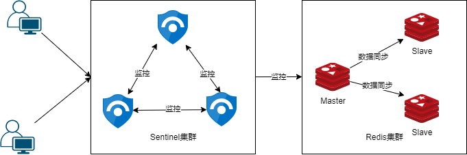

# Redis哨兵高可用模式

## 1. 介绍

当仅使用主从复制架构模式，如果master宕机了，不仅会造成redis集群在短期内不可用，而且需要手动把其他redis切换成master，很明显，这样操作非常不优雅。所以为了解决这种问题，更多时候我们会选择哨兵模式。

哨兵(`Sentinel`)是用于监控redis集群中Master状态的工具，是Redis 的高可用性解决方案。sentinel系统可以监视一个或者多个redis master服务，以及这些master服务的所有从服务；当某个master服务下线时，自动将该master下的某个从服务升级为master服务替代已下线的master服务继续处理请求。

当一个集群中的master失效之后，sentinel可以选举出一个新的master用于自动接替master的工作，集群中的其他redis服务器自动指向新的master同步数据。一般建议sentinel采取奇数台且至少为3个，防止某一台sentinel无法连接到master导致误切换。



## 2. 搭建哨兵模式

redis的哨兵其实就是一种特殊的redis进程，在redis-server启动时添加`--sentinel`参数即可启动哨兵。

在启动哨兵之前呢，我们需要修改一下哨兵的配置，默认的配置文件可以在redis的根目录下找到，示例如下：

```
# 配置文件：sentinel.conf，在sentinel运行期间是会被动态修改的
# sentinel如果重启时，根据这个配置来恢复其之前所监控的redis集群的状态
# 绑定IP
bind 0.0.0.0
# 后台运行
daemonize yes
# 默认yes，没指定密码或者指定IP的情况下，外网无法访问
protected-mode no
# 哨兵的端口，客户端通过这个端口来发现redis
port 26380
# 哨兵自己的IP，手动设定也可自动发现，用于与其他哨兵通信
# sentinel announce-ip
# 临时文件夹
dir /tmp
# 日志
logfile "/usr/local/redis/logs/sentinel-26380.log"
# sentinel监控的master的名字叫做mymaster,初始地址为 127.0.0.1 6380,2代表两个及以上哨兵认定为死亡，才认为是真的死亡
sentinel monitor mymaster 127.0.0.1 6380 2
# 发送心跳PING来确认master是否存活
# 如果master在“一定时间范围”内不回应PONG 或者是回复了一个错误消息，那么这个sentinel会主观地(单方面地)认为这个master已经不可用了
sentinel down-after-milliseconds mymaster 1000
# 如果在该时间（ms）内未能完成failover操作，则认为该failover失败
sentinel failover-timeout mymaster 3000
# 指定了在执行故障转移时，最多可以有多少个从Redis实例在同步新的主实例，在从Redis实例较多的情况下这个数字越小，同步的时间越长，完成故障转移所需的时间就越长
sentinel parallel-syncs mymaster 1
```

修改完哨兵的配置文件以后，就可以来启动哨兵了

```shell
./redis-server ../sentinel.conf --sentinel
```

注意，哨兵最好启动三个及以上，并且是奇数

## 3. 在Spring Boot中使用哨兵模式

在日常开发中，我们通常都是使用Spring Data Redis提供的的RedisTemplate来操作redis的。其实，`Spring Data Redis`是支持哨兵模式的，而且是低侵入式的，只需要在构建`RedisConnectionFactory `时，使用`RedisSentinelConfiguration`就可以了，下面时spring官方针对于`Jedis`和`Lettuce`给出的示例代码：

```java
/**
 * Jedis
 */
@Bean
public RedisConnectionFactory jedisConnectionFactory() {
  RedisSentinelConfiguration sentinelConfig = new RedisSentinelConfiguration()
  .master("mymaster")
  .sentinel("127.0.0.1", 26379)
  .sentinel("127.0.0.1", 26380);
  return new JedisConnectionFactory(sentinelConfig);
}

/**
 * Lettuce
 */
@Bean
public RedisConnectionFactory lettuceConnectionFactory() {
  RedisSentinelConfiguration sentinelConfig = new RedisSentinelConfiguration()
  .master("mymaster")
  .sentinel("127.0.0.1", 26379)
  .sentinel("127.0.0.1", 26380);
  return new LettuceConnectionFactory(sentinelConfig);
}
```

具体详情可见：[Spring Data Redis Sentinel](https://docs.spring.io/spring-data/redis/docs/current/reference/html/#redis:sentinel)

## 4. 哨兵模式核心知识点

### 4.1 核心运作流程

#### 4.1.1 服务发现和健康状况检查流程

1. 搭建redis组成集群
2. 启动哨兵（客户端需要通过哨兵来发现redis实例信息）
3. 哨兵通过连接master发现主从集群内的所有实例信息
4. 哨兵监控redis实例的监控状况

这个可能理解起来比较抽象，举个比较生动的例子来说吧，在这个场景中呢，有一个大哥`Master`，大哥手下有几个秘书`Sentinel`和几个小弟`Slave`。这几个秘书就干两件事儿，如果有人来找大哥，就汇报一下大哥的位置，第二件事就是有事儿没事儿看看大哥死没死，非常的叛逆。剩下几个小弟就是帮大哥分担一些事情的，但是主要的活儿(例如写操作和数据同步)还是由大哥来干。

#### 4.1.2 故障切换流程

1. 哨兵一旦发现master不能正常工作则会通知其他哨兵
2. 当一定量的哨兵都认为master挂了
3. 选举一个哨兵作为故障转移的执行者
4. 执行者在活着的slave中选取一个作为新的master
5. 将其他slave重新设定为新master的从属

咱们接着上面的故事讲，突然有一天，有一个秘书发现大哥"嘎"了，这时候秘书们会依次都去看看大哥是不是真的嘎`客观下线`了，如果有一定数量的秘书都认为大哥确实噶了，那不管大哥是不是真的嘎了，都要给大哥送走。如何给大哥抬走也是非常讲究的，首先秘书们会先选`举出`一个倒霉鬼`执行者`去把大哥抬走，然后选择大哥手下一个帅气小弟成为新大哥，再告诉其他的小弟和秘书新大哥上位了。

### 4.2 哨兵如何知道Redis主从信息

在哨兵配置文件中，保存着集群中master的信息，可通过`info`命令进行主从信息的发现。

在《redis主从复制》这边文章中其实有提到过，`info replication`这个命令，其实哨兵也是通过这条命令来获取主从信息的。

### 4.2 主观下线和客观下线

哨兵在运行过程中，会向 Redis 节点发送 `PING` 命令，来检查节点的状态，并且通过节点的回复来判断节点是否在线。 

 #### 4.2.1 主观下线

主观下线(`sdown`)的意思是，单个哨兵自己认为redis实例以及并能再提供服务了。

当向redis节点发送`ping`命令后，如返回为`+PONG`、`-LOADING`、`-MASTERDOWN`这三种情况为正常，返回其他或不返回则被认定为无效。

可以在配置文件中配置`sentinel down-after-milliseconds mymaster 1000`来设置超时时间。

#### 4.2.2 客观下线

刚才我们介绍的主管下线其实是单个哨兵做成的判断，那么什么是客观下线呢?

客观下线(`odown`)是指一定数量的哨兵都认为master已经下线了。

当某个哨兵主管认为master下线以后，则会通过`sentinel is-master-down-by-addr`向其他哨兵询问master是否已经下线，如果`quorum`个哨兵都认为master下线了，那么就会认为master客观下线了，开始执行故障转移。

### 4.3 哨兵之间是如何通信的

Sentinel节点连接一个 Redis 实例的时候，会创建 `cmd` 和 `pub/sub` 两个 **连接**。`Sentinel` 通过 `cmd` 连接给 `Redis` 发送命令，通过 `pub/sub` 连接到 `Redis` 实例上的其他 Sentinel 实例。

`Sentinel` 与 `Redis` **主节点** 和 **从节点** 交互的命令，主要包括：

| 命令      | 作用                                                         |
| --------- | ------------------------------------------------------------ |
| PING      | Sentinel 向 Redis 节点发送 PING 命令，检查节点的状态         |
| INFO      | Sentinel 向 Redis 节点发送 INFO 命令，获取它的 从节点信息    |
| PUBLISH   | Sentinel 向其监控的 `Redis` 节点 `__sentinel__:hello` 这个 `channel` 发布 自己的信息 及 主节点 相关的配置 |
| SUBSCRIBE | `Sentinel` 通过订阅 `Redis` 主节点 和 从节点 的 `__sentinel__:hello` 这个 `channnel`，获取正在监控相同服务的其他 `Sentinel` 节点 |

哨兵同步`pub/sub`机制发日志解析如下：

```
# https://redis.io/topics/sentinel#pubsub-messages
+reset-master <instance details> -- 当master被重置时.
+slave <instance details> -- 当检测到一个slave并添加进slave列表时.
+failover-state-reconf-slaves <instance details> -- Failover状态变为reconf-slaves状态时
+failover-detected <instance details> -- 当failover发生时
+slave-reconf-sent <instance details> -- sentinel发送SLAVEOF命令把它重新配置时
+slave-reconf-inprog <instance details> -- slave被重新配置为另外一个master的slave，但数据复制还未发生时。
+slave-reconf-done <instance details> -- slave被重新配置为另外一个master的slave并且数据复制已经与master同步时。
-dup-sentinel <instance details> -- 删除指定master上的冗余sentinel时 (当一个sentinel重新启动时，可能会发生这个事件).
+sentinel <instance details> -- 当master增加了一个sentinel时。
+sdown <instance details> -- 进入SDOWN状态时;
-sdown <instance details> -- 离开SDOWN状态时。
+odown <instance details> -- 进入ODOWN状态时。
-odown <instance details> -- 离开ODOWN状态时。
+new-epoch <instance details> -- 当前配置版本被更新时。
+try-failover <instance details> -- 达到failover条件，正等待其他sentinel的选举。
+elected-leader <instance details> -- 被选举为去执行failover的时候。
+failover-state-select-slave <instance details> -- 开始要选择一个slave当选新master时。
+no-good-slave <instance details> -- 没有合适的slave来担当新master
+selected-slave <instance details> -- 找到了一个适合的slave来担当新master
+promoted-slave -- 确认成功
+failover-state-reconf-slaves -- 开始对slaves进行reconfig操作
+slave-reconf-sent -- 向指定的slave发送“slaveof”指令，告知此slave跟随新的master
+slave-reconf-inprog -- 此slave正在执行slaveof + SYNC过程，slave收到“+slave-reconf-sent”之后将会执行slaveof操作
+slave-reconf-done -- 此slave同步完成，此后leader可以继续下一个slave的reconfig操作
failover-state-send-slaveof-noone <instance details> -- 当把选择为新master的slave的身份进行切换的时候。
failover-end-for-timeout <instance details> -- failover由于超时而失败时。
failover-end <instance details> -- failover成功完成,故障转移结束
switch-master <master name> <oldip> <oldport> <newip> <newport> -- 当master的地址发生变化时。通常这是客户端最感兴趣的消息了。
+tilt -- 进入Tilt模式。
-tilt -- 退出Tilt模式。
```

### 4.4 哨兵选举机制

哨兵选举是基于`Raft算法`实现的选举机制，流程简述如下：

1. 拉票阶段： 每个哨兵节点都希望自己成为领导者；
2. Sentinel节点收到拉票命令后，如果没用收到或同意过其他节点的请求，就同意该节点的请求，也就是说每个sentinel只持有一个同意票数；
3. 如果Sentinel发现自己的票数已经超过一半的数值，那么它将成为领导者，去执行故障转移；
4. 投票结束后，如果超过`failover-timeout`的时间内，没进行实际的故障转移操作，则重新拉票选举；、

更多关于raft协议详见：[The Secret Lives of Data](http://thesecretlivesofdata.com/)

### 4.5 master选举方案

到目前，我们已经有了一个执行者哨兵，那么现在，我们同样也要挑选出一个符合要求的redis服务，使之成为master

1. `slave`节点状态：非`S_DOWN`、`O_DOWN`、`DISCONNECTED`；
2. 优先级：在redis.conf中有一个配置项`slave-priority`值越小，优先级越高；
3. 数据同步情况：Replication offset process
4. run id：ASCII码最小的

### 4.6 主从切换过程

- 针对即将成为master的slave节点，将其撤出主从集群，执行`slaveof NO ONE`

- 针对其他slave节点，使他们成为新的master从属，执行`slaveof [新master ip] [新master port]`
